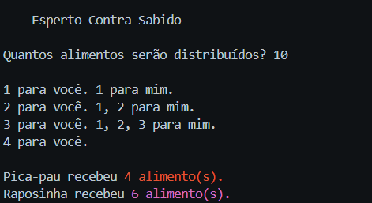

# Projeto Final Dev CSharp - 2024 👨‍💻
Este programa tem a funcionalidade de reproduzir o icônico momento de um episódio de Pica-Pau, onde a personagem Raposinha divide de forma "igual" a quantidade de alimentos para os dois.


---

## Ferramentas necessárias 🔧
Para utilizar o programa faz-se necessário o uso do Kit de desenvolvimento .NET SDK [clicando aqui](https://dotnet.microsoft.com/pt-br/download), você será redirecionado para o site oficial de download da ferramenta.

## _Download_ do programa 💾
[Clique aqui para baixar o programa.](dist/ProjetoFinalEspertoContraSabido.zip)

## Comando para executar o programa ⌨

```
dotnet ProjetoFinalEspertoContraSabido.dll
```

## Como executar o programa? 😱

### 1º passo
Após [baixar o programa](dist/ProjetoFinalEspertoContraSabido.zip), é necessário [descompactá-lo](https://support.microsoft.com/pt-br/windows/compactar-e-descompactar-arquivos-8d28fa72-f2f9-712f-67df-f80cf89fd4e5#:~:text=Para%20descompactar%20um%20%C3%BAnico%20arquivo,..e%20siga%20as%20instru%C3%A7%C3%B5es.). Lembre-se de realizar esta ação dentro do local desejado, e também de lembrar em qual local está seu programa.

### 2º passo
Logo após realizar o **1º passo**, abra o seu [prompt de comando](https://tecnoblog.net/responde/7-maneiras-de-abrir-o-prompt-de-comando-no-windows-10-e-11/) acessando a pasta onde o programa foi descompactado [(clique aqui para saber mais sobre comandos de prompt)](https://dtnetwork.com.br/comandos-basicos-do-cmd/).

### 3º passo
Depois de realizar o **2º passo**, basta utilizar o comando abaixo:

-> **dotnet ProjetoFinalEspertoContraSabido.dll** <-

Para facilitar seu trabalho, copie o comando clicando no canto superior direito do bloco, localizado na sessão **"comando para executar o programa"**.

## Imagem do programa em funcionamento 📸



## Colaboradores 🤜💥🤛

[NBenevides](https://github.com/NBenevides)

[RuanMSantos](https://github.com/RuanMSantos)

## Agradecimentos 🤝
Gostaria de agradecer grandemente aos professores [Ermogenes Palacio](https://github.com/ermogenes) e [Diego Neri](https://github.com/diegoneri) por todo conhecimento e material disponibilizado, além de todo apoio e ajuda durante o decorrer deste primeiro módulo do [curso de Informática](https://etecab.cps.sp.gov.br/cursos/cursos-tecnicos-modalidade-presencial/informatica/) da [ETEC Adolpho Berezin.](https://etecab.cps.sp.gov.br/) Por fim, gostaria de agradecer meu grande amigo [Yukio Sato](https://github.com/yukio-sato) por todo apoio e por ensinar à mim seus conhecimentos avançados sobre programação.